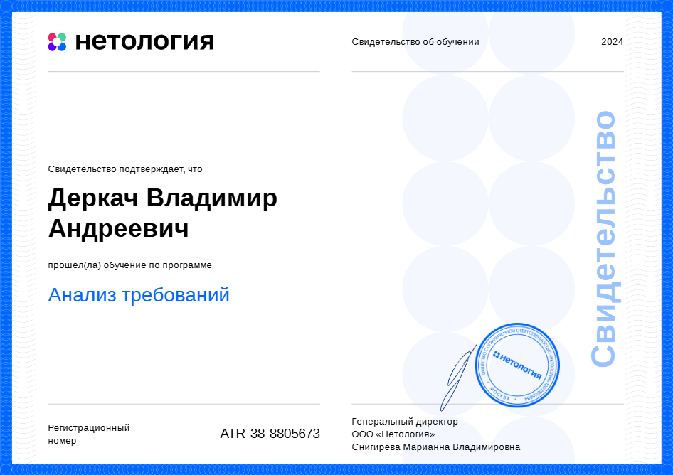
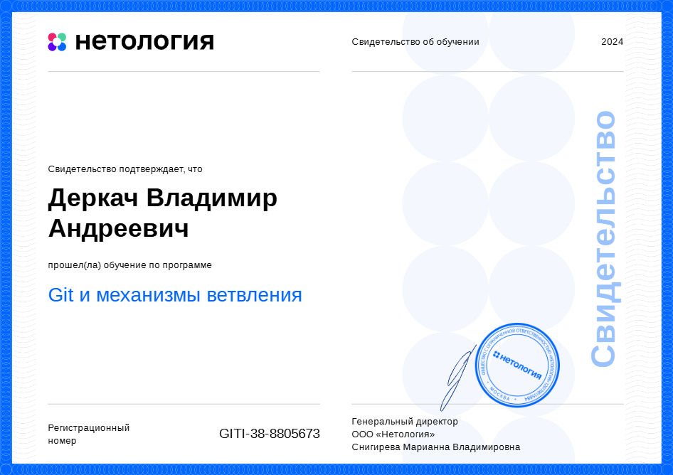
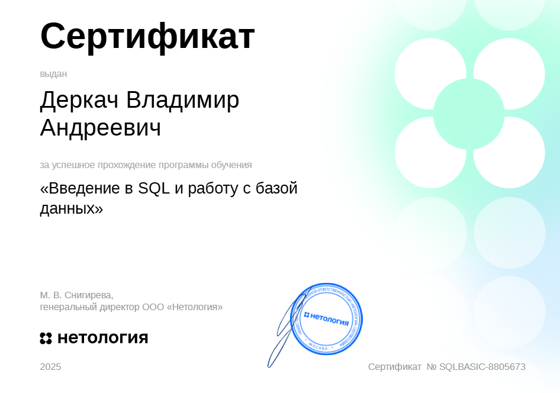
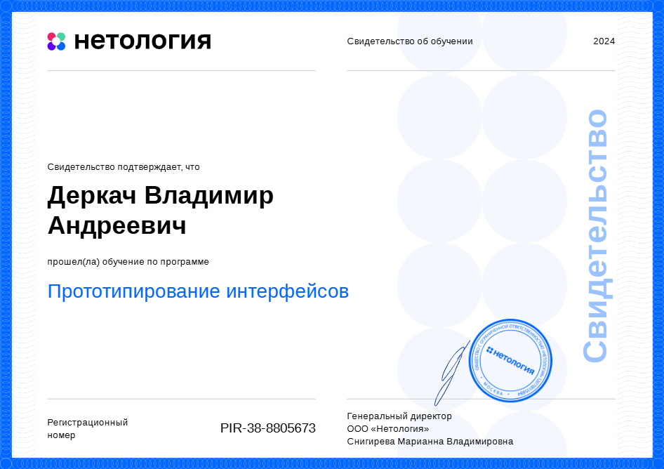
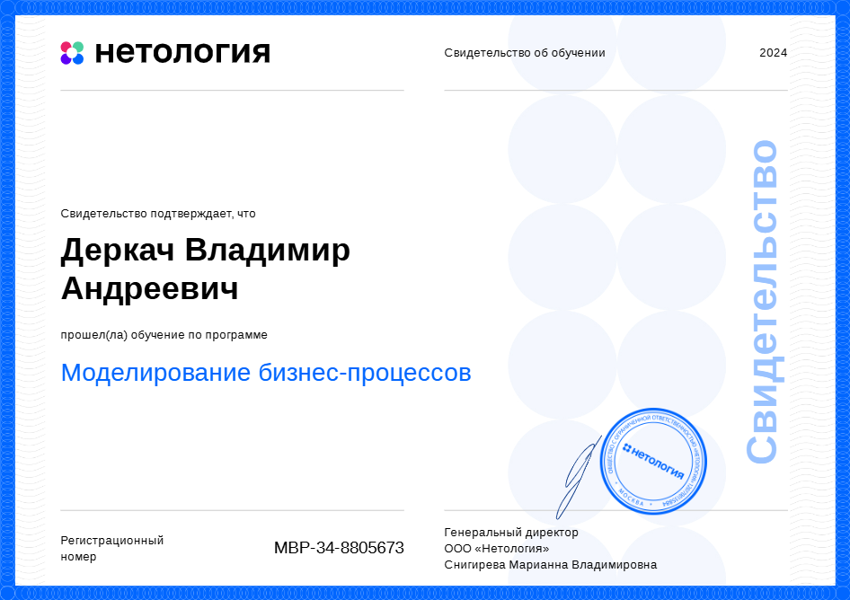
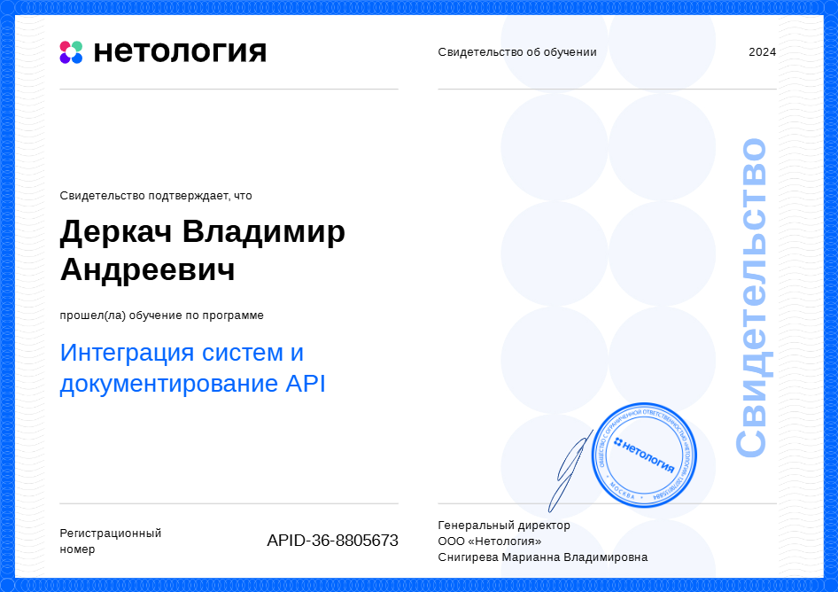
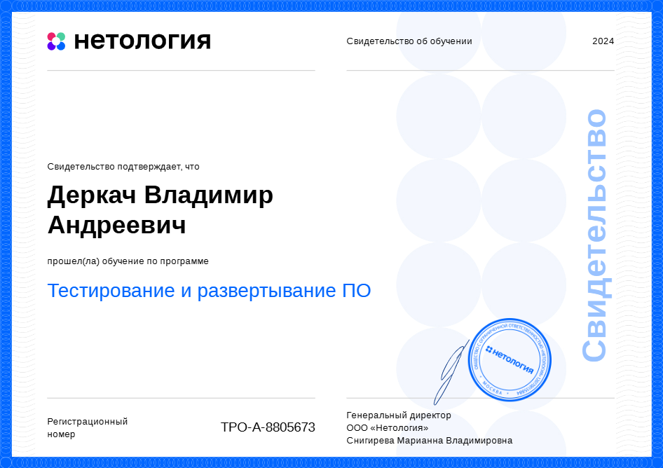
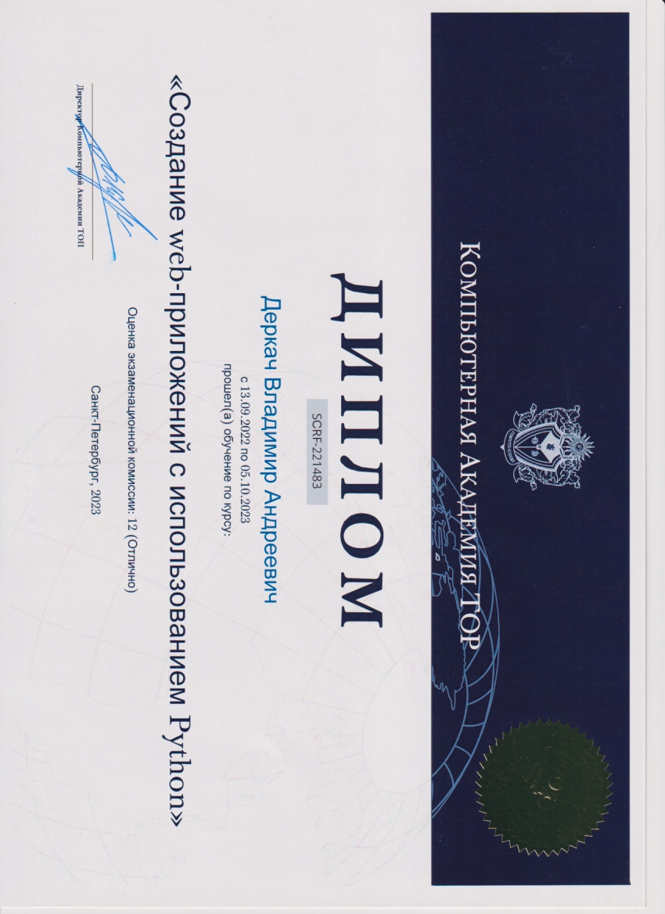
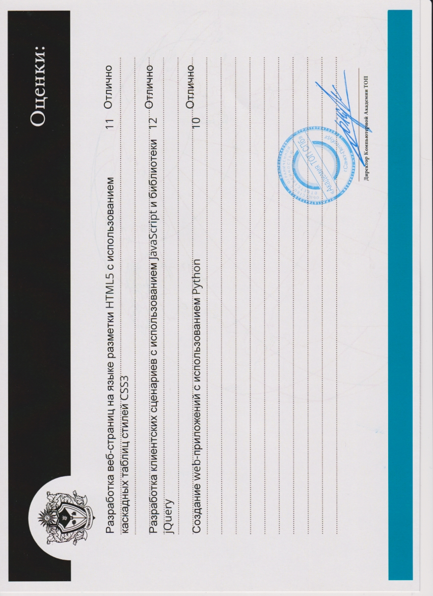

<link rel="stylesheet" href="styles.css">

# Деркач Владимир Андреевич

## Специальность
Системный аналитик (начинающий специалист)

## Контактная информация
- Телефон: +79657644942
- Email: [vova.derkach.89@mail.ru](mailto:vova.derkach.89@mail.ru)
- Telegram: [@vladimir_derka4_official](https://t.me/vladimir_derka4_official)

## Опыт в профессии
Диплом о профессиональной переподготовке.

## Учебная платформа
Нетология

## Модули пройденные в процессе обучения

### 1. Жизненный цикл разработки ПО
- Обзор информационных систем
- Роли в команде разработки
- Что такое Agile и как его применять
- Гибкие методологии: Scrum, eXtreme programming и Kanban

### 2. Работа в проектной команде по Agile
- Знакомство интерактивная платформа для совместной работы "Miro"
- Анализ предметной области
- Работа в проектной команде по Agile

### 3. Анализ требований
- Требования к разработке ПО
- Методы сбора требований
- Методы формализации требований - по классификации
- Business canvas model
- User stories и job stories
- Унифицированный язык моделирования. Диаграмма классов
- Диаграмма вариантов использования (USE CASE)
- Описание вариантов использования
- Диаграммы активности и последовательности (sequence diagram)
- Согласование и управление изменениями требований
- Итоговая работа

### 4. Git и механизмы ветвления
- Знакомство с системой контроля версий Git
- Работа с локальным репозиторием в Git
- Работа с удаленным репозиторием через GitHub
- Branching стратегии

### 5. SQL и получение данных
- Работа с PostgreSQL
- Работа с DBeaver
- Работа с SQL-запросами
- Практические занятия

### 6. Прототипирование интерфейсов
- Основы UX/UI
- Знакомство и прототипирование в Figma
- Практические занятия

### 7. Моделирование бизнес-процессов
- Моделирование бизнес-процессов и нотация BPMN (теория)
- Потоки данных
- Практические занятия
- Итоговая работа

### 8. Интеграция систем и документирование API
- Роль API и протокола HTTP при взаимодействии между системами
- REST как архитектура
- Протокол SOAP
- Нотация OpenAPI
- Практические занятия (Swagger)
- REST API
- Тестирование API: работа в Postman
- Итоговая работа

### 9. Тестирование и развертывание ПО
- Введение в тестирование
- Техники и инструменты тестирования
- Принципы и инструменты DevOps

### 10. Итоговый модуль профессии «Системный аналитик»
- Подготовка к дипломной работе

## Итоговая работа

Передо мной стояла задача реализовать спецификацию с требованиями на разработку мобильного приложения «Мой мобильный оператор». Данное мобильное приложение предназначено для абонентов мобильной связи и представляет собой удобный интерфейс для управления своими услугами, тарифами и настройками.

Что входило в итоговую работу:
- Разработка спецификации для проектной работы
- Сбор требований на основе интервью с заказчиком
- USE CASE диаграмма
- Формализация требований
- ER-диаграмма
- Создание прототипа в Figma
- Swagger документация

## Успешное прохождение курса по изучению языка программирования Python

### Тема проекта: Создание web-приложения

